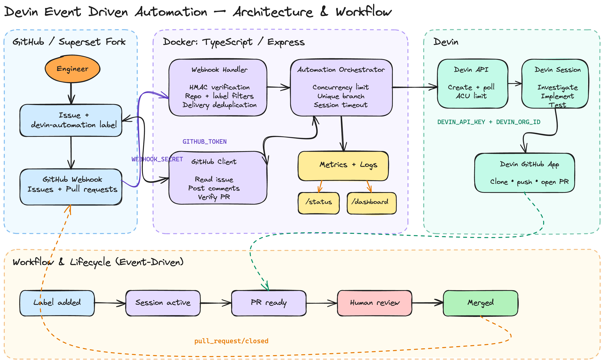

# Devin Automation Service

An event-driven issue remediation service for an Apache Superset fork. A signed GitHub issue event starts and monitors a Devin API session, verifies the resulting pull request, and exposes progress and evidence for engineering reviewers. A later signed pull-request event advances the tracked task to merged.

## Capabilities

| Capability | Behavior |
| --- | --- |
| Event handling | Accepts signed GitHub issue and merged-PR events for the configured repository, with duplicate and overlapping-work protection within one process. |
| Session management | Creates and monitors Devin API v3 sessions with configurable concurrency, timeouts, and per-session ACU limits. |
| PR handoff | Checks that a non-draft PR comes from the assigned branch, targets the repository's default branch, and contains changes; posts progress and outcome comments on the issue. |
| Observability | Exposes task outcomes, timing, and issue/session/PR links through logs, JSON status, and an auto-refreshing dashboard. Tracks human merges through GitHub events. |
| Local deployment | Runs through Docker Compose, with a public HTTPS endpoint required for GitHub webhook delivery. |

## Workflow and architecture



The service verifies signed GitHub events, coordinates a bounded Devin session, verifies the resulting PR, and exposes its state through JSON metrics and an HTML dashboard. Devin uses its GitHub App to clone, implement, test, push, and open the PR; human review and merging remain outside the automation boundary.

Devin provides the engineering execution: it interprets an issue, investigates the codebase, implements a change, runs relevant checks, and delivers a pull request for review. This lets engineers delegate investigation and implementation without writing a custom remediation script for each issue. The coordinator manages that work with per-session ACU limits, concurrency controls, PR checks, and visible progress; engineers retain responsibility for assessing correctness and approving merges.

## Local setup

See the [experiment setup guide](docs/SETUP_GUIDE.md) for Devin credentials, the Devin GitHub App, GitHub token permissions, webhooks, Docker, and ngrok. The short local path is:

```bash
npm ci
cp .env.example .env
# Edit .env with your configuration.
npm run devin:check
npm test
docker compose up --build
```

With the service running, use:

```bash
curl http://localhost:3000/health
curl http://localhost:3000/status
# Open http://localhost:3000/dashboard in a browser
```

`npm run devin:check` is read-only. Adding `devin-automation` to an eligible issue starts paid work; do that only after completing the full setup guide.

## Run the workflow

After completing the [experiment setup guide](docs/SETUP_GUIDE.md), run the end-to-end workflow as follows:

1. Start the service with `docker compose up --build` and expose it through the configured HTTPS tunnel.
2. Confirm `/health` is healthy and GitHub can successfully deliver webhook events.
3. Create or select an open issue in the configured repository, then add the configured automation label (`devin-automation` by default). This starts paid Devin work.
4. Open [the dashboard](http://localhost:3000/dashboard). It refreshes automatically and should show the accepted task, active Devin session, and eventual PR handoff. Use [the JSON status endpoint](http://localhost:3000/status) for machine-readable evidence.
5. Follow the session link to inspect Devin's work and review the resulting pull request, including its diff and reported validation.
6. Merge the pull request manually if it meets the review bar. Once the service processes the signed `pull_request/closed` webhook, the dashboard shows **Merged** on its next refresh (every 10 seconds).

A successful run links the issue, Devin session, and reviewable pull request through progress comments and dashboard status. The dashboard explains that PR readiness is a handoff for human review: review the changes and test evidence before merging. The service does not merge pull requests or close issues.

## Known gaps

1. **Independent validation:** PR readiness and Devin-reported test evidence are captured, but CI is not ingested. JSON activity records retain `validation: unverified`; the dashboard shows a review reminder instead of a validation column.
2. **Session controls:** Automate recovery/resumption of monitored sessions. A monitoring failure, blocked state, or unconfirmed termination releases local capacity while the remote session may remain resumable or active. Concurrency controls local tasks; the submitted per-session ACU limit is not a global spending cap.
3. **Durable tasks:** Persist recoverable task records and delivery IDs, resume monitoring after restart, and derive aggregates from records. Current JSON aggregates preserve reporting but are not a task queue.
4. **Simulation:** Provide a user-facing credential-free simulation. Regression tests use fake clients but are not yet a complete demo command.

Logs are written to `logs/combined.log` and `logs/error.log`; aggregate metrics are saved in `logs/metrics.json`. Log rotation is not implemented. Running sessions are not stored as recoverable task records.

For new runs, `successfulSessions` means a completion signal followed by a verified reviewable PR, not passing tests. A subsequent verified GitHub webhook records `merged` as the task's latest lifecycle state without changing the successful-session count.
