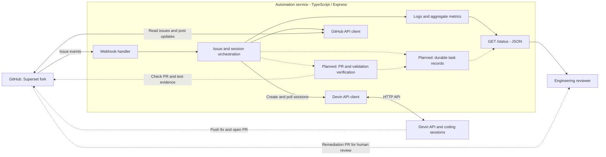
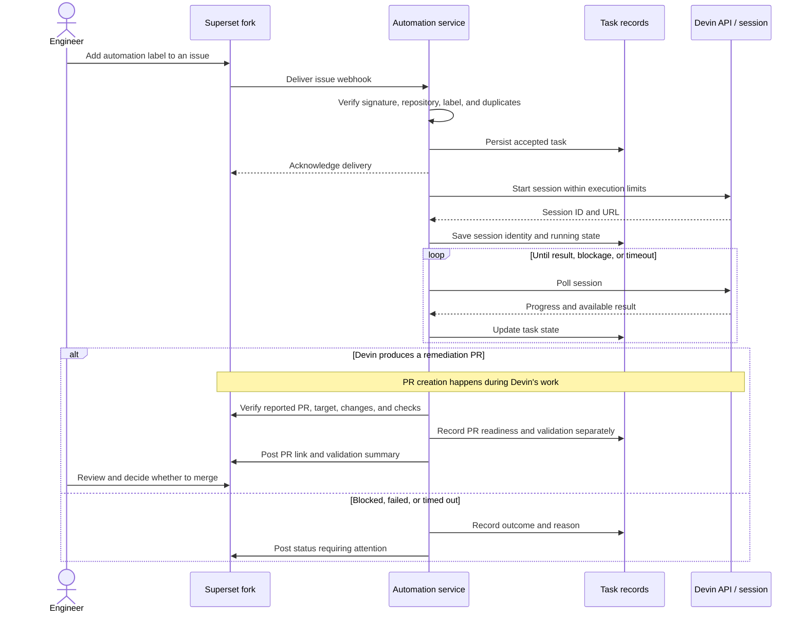

# Devin Automation Service

An event-driven issue remediation prototype for an Apache Superset fork. The intended workflow turns selected GitHub issues into pull requests through the Devin API, with observable progress and validation evidence.

## Current status

This is a scaffold, not yet a demonstrated end-to-end remediation system. Local review on September 9, 2026 confirmed that TypeScript checking passes. Live Devin integration, successful remediation, and Docker execution remain unverified.

| Component | Current state |
| --- | --- |
| Express | Issue webhook, health, and JSON status routes are implemented. |
| Devin client | Session creation, polling, and cancellation code exists; the API contract and lifecycle assumptions need verification. |
| GitHub client | Issue reads/comments, branch/PR creation, and issue closure methods exist. |
| Remediation handoff | Incomplete: PR logic branches from the default branch instead of using Devin's changes. |
| Observability | Winston logs and persisted aggregate metrics exist; counts are not yet reliable remediation evidence. |
| Docker | Configuration exists but has build blockers. |
| Validation | Type checking passes; lint configuration and a working test setup are missing. |

## Workflow and architecture

### High-level overview

This is the intended end-to-end architecture. The service scaffold exists; the live integration and actual remediation PR handoff still need completion and verification.

```text
+------------------+      +------------------------+      +------------------+
| GitHub webhook   |----->| Automation service     |----->| Devin API        |
| Issue events     |      | Express / TypeScript   |<-----| Coding sessions  |
+------------------+      |                        |      +------------------+
                          | - Session coordination |               |
                          | - GitHub client        |               | Fix, test,
                          | - Logs and metrics     |               | open PR
                          +------------------------+               v
                               |              |          +------------------+
                  Read issues, |              |          | Superset fork    |
                  post updates |              |          | Remediation PR   |
                               +------------------------>|                  |
                                              |          +------------------+
                                              v                   |
                                     +------------------+         |
                                     | Status report    |         |
                                     | Progress / links |         |
                                     +------------------+         |
                                              |                   |
                                              v                   v
                                     +--------------------------------------+
                                     | Engineering reviewer                 |
                                     | Inspect evidence and review the PR   |
                                     +--------------------------------------+
```

The service starts and monitors Devin's work, then verifies and reports the resulting PR. Logs and metrics cover the workflow as a whole rather than only GitHub operations.

The scaffold receives issue events, fetches the configured repository's issue, checks eligibility, creates a Devin session, polls it, and attempts GitHub updates.

### Components and boundaries

Solid arrows represent integration paths present in the scaffold, not verified live behavior. Dashed arrows represent planned work. The service's Docker packaging still requires repair.



The existing placeholder PR branch logic is omitted from the intended handoff above; it must be replaced with Devin's actual changes.

### Target execution flow

This sequence describes the intended completed system. Deduplication, durable state, execution limits, and verified PR reporting remain implementation work.



Devin performs the engineering work; this service coordinates it. Human review and merging remain outside the intended automation scope. Session completion alone does not establish a successful fix.

The stack is Node.js 20+, TypeScript, Express, Axios, Octokit, Winston, and dotenv.

## Local setup

From this repository's root:

```bash
npm install
cp .env.example .env
# Edit .env with your configuration.
npm run typecheck
npm run build
npm start
```

Use `npm run dev` to run the TypeScript entry point directly. These are the scaffold's startup commands; live integration has not been validated. Missing credentials currently produce warnings instead of preventing startup.

With the service running on the default port:

```bash
curl http://localhost:3000/
curl http://localhost:3000/health
curl http://localhost:3000/status
```

`/health` reports process availability, not GitHub or Devin connectivity. `/status` returns JSON rather than a graphical dashboard. A credential-free workflow simulation is planned but not implemented.

### Configuration

These describe the current implementation, including API defaults still requiring verification. Keep credentials in the Git-ignored `.env` file.

| Variable | Purpose | Current default |
| --- | --- | --- |
| `DEVIN_API_KEY` | Devin credential | Empty; startup warning |
| `DEVIN_ORG_ID` | Organization used in API paths | Empty; startup warning |
| `DEVIN_API_BASE_URL` | API base URL | `https://api.devin.ai/v3` |
| `GITHUB_TOKEN` | GitHub credential | Empty; startup warning |
| `GITHUB_REPO_OWNER` | Target fork owner | `chengify` |
| `GITHUB_REPO_NAME` | Target repository | `superset` |
| `GITHUB_WEBHOOK_SECRET` | Webhook signing secret | Empty; startup warning |
| `PORT` | HTTP port | `3000` |
| `NODE_ENV` | Environment/logging behavior | `development` |
| `AUTO_LABEL` | Automation eligibility label | `devin-automation`; currently hard-coded separately in the webhook handler |
| `SESSION_TIMEOUT_MINUTES` | Polling timeout | `30` |
| `MAX_CONCURRENT_SESSIONS` | Intended concurrency limit | `3`; not enforced |

### Docker status

Docker is required for the final deliverable, but the current configuration is not ready:

- The Dockerfile copies `dist`, while `.dockerignore` excludes it and the image does not compile source.
- `npm ci` requires a lockfile, but `package-lock.json` is ignored by Git, preventing a reproducible fresh-checkout build.

The planned repair installs locked dependencies and compiles TypeScript within the Docker build. After repair and verification, the intended command is `docker compose up --build`. It is not yet a working quick start.

### Webhook status

The intended configuration uses the fork's **Issues** events, JSON content type, the shared signing secret, and `https://<service-host>/webhook/github`. Adding the automation label should select an issue for processing.

Fix the gaps below before enabling live events. The current handler can trigger paid sessions and issue updates, including premature issue closure.

## Known gaps

1. **Actual PR handoff:** Replace placeholder branch creation with Devin's real PR. Explicitly identify the fork and PR requirements in the prompt instead of assuming the repository is checked out. Verify the PR targets the fork and contains changes.
2. **Accurate outcomes:** Remove issue closure on session completion. Track PR readiness and validation separately. Currently PR creation errors can be swallowed while the issue is reported resolved.
3. **Event handling:** Verify signatures against original request bytes, validate the repository and specific label added, and deduplicate deliveries and overlapping issue runs.
4. **Session controls:** Verify the API contract, enforce concurrency, and handle blocked/terminal states. Apply a spending limit if supported by the selected API. Polling currently retries errors at a fixed interval; exponential backoff is not implemented.
5. **Durable tasks:** Persist issue/session identifiers, timestamps, state, PR links, and validation evidence; resume monitoring after restart. Derive metrics from records to prevent negative active counts and double-counted outcomes.
6. **Reproducible execution:** Repair Docker and lint configuration, add focused tests, and implement an explicitly labeled simulation without external credentials.

Logs are written to `logs/combined.log` and `logs/error.log`; aggregate metrics are saved in `logs/metrics.json`. Log rotation is not implemented. Running sessions are not stored as recoverable task records.

## Candidate Superset issues

The local Superset checkout points to `chengify/superset`. Earlier notes report issues #1–4; their remote existence and current state have not been independently verified in this review.

| Candidate | Required refinement |
| --- | --- |
| Database utility duplication | Specify the actual refactor, affected callers, and regression tests; removing TODO text alone is not a fix. |
| Embedded dashboard UUID filtering | Establish compatibility requirements before removing integer-ID behavior. |
| Paramiko constraint | Establish a concrete dependency problem and compatibility evidence; the notes do not establish a vulnerability. |
| Frontend type safety | Select specific files, bounded changes, and a reproducible type check. |

Choose one or two issues with clear acceptance criteria. No remediation is claimed complete here.

## Validation and source layout

Local checks observed on September 9, 2026:

| Command | Result |
| --- | --- |
| `npm run typecheck` | Passed. |
| `npm run lint` | Failed: ESLint configuration missing. |
| `npm test -- --runInBand` | Failed: Jest is not installed. |
| Docker and live issue-to-PR execution | Not verified. |

```text
src/index.ts                 Express routes and startup
src/config/index.ts          Environment configuration
src/webhook/handler.ts       Issue event handling
src/automation/service.ts    Issue/session orchestration
src/devin/client.ts          Devin HTTP client and polling
src/github/client.ts         GitHub operations and signature helper
src/observability/           Logging and aggregate metrics
Dockerfile                   Container scaffold requiring repair
docker-compose.yml           Service configuration
```

## Demo and submission

Demonstrate a real event starting a Devin session and producing a reviewable Superset fix with validation evidence. Provide the solution repository, the fork with selected issues and remediation PRs, verified Docker/run-or-simulate instructions, and a five-minute Loom covering the problem, demo, architecture, Devin's role, and next steps.

Report observed outcomes; label projected time savings as estimates. The known gaps above describe the remaining implementation work.
