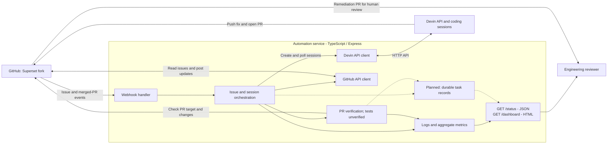
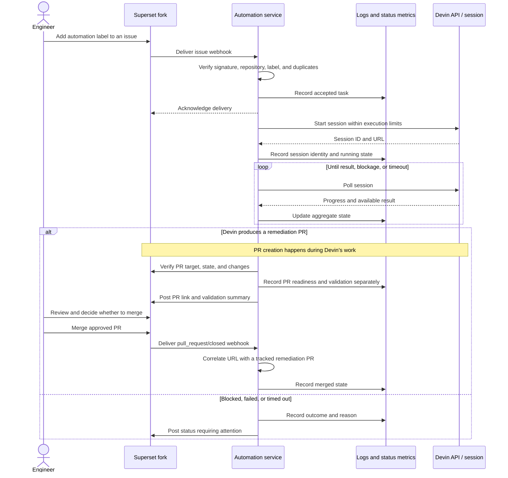

# Devin Automation Service

An event-driven issue remediation service for an Apache Superset fork. A signed GitHub issue event starts and monitors a Devin API session, verifies the resulting pull request, and exposes progress and evidence for engineering reviewers. A later signed pull-request event advances the tracked task to merged.

## Current status

The workflow has been demonstrated end to end against `chengify/superset`: labeling issue #1 triggered a real Devin session and produced PR #5, which was subsequently reviewed and merged. The service reports the merged lifecycle state while keeping test validation explicitly unverified until independent CI or local confirmation exists.

| Component | Current state |
| --- | --- |
| Express | Verifies signatures from original request bytes, handles issue and merged-PR events, suppresses duplicate/overlapping work, and exposes health, JSON status, and HTML dashboard routes. |
| Devin client | Uses the live v3 contract, opaque session IDs, bounded GET retries, native lifecycle states, per-session ACU limits, and archived timeout termination. |
| GitHub client | Reads issues, posts progress comments, verifies webhook signatures, and validates the resulting PR's repository, branch, base, state, and changed-file count. |
| Remediation handoff | Verified live: issue #1 → Devin session → unique branch → non-draft PR #5 targeting `master` → human merge. |
| Observability | Reports active/successful/blocked/failed counts plus issue, session, PR, timing, reason, and validation fields. Error diagnostics are sanitized. |
| Docker | Live Compose service and public HTTPS webhook endpoint returned healthy responses during the demonstrated run. |
| Validation | Compilation, lint, and 31 regression/contract tests pass. Devin's Superset results are captured separately from independent validation. |

## Workflow and architecture

### High-level overview

This architecture was exercised by the verified issue #1 run. Durable task storage and independent CI ingestion remain future extensions.

```text
+------------------+      +------------------------+      +------------------+
| GitHub webhook   |----->| Automation service     |----->| Devin API        |
| Issue events     |      | Express / TypeScript   |<-----| Coding sessions  |
+------------------+      |                        |      +------------------+
                          | - Session coordination |               |
                          | - GitHub client        |               | Fix, test,
                          | - Logs and metrics     |               | open PR
                          +------------------------+               v
                               |              |          +------------------+
                  Read issues, |              |          | Superset fork    |
                  post updates |              |          | Remediation PR   |
                               +------------------------>|                  |
                                              |          +------------------+
                                              v                   |
                                     +------------------+         |
                                     | Status report    |         |
                                     | Progress / links |         |
                                     +------------------+         |
                                              |                   |
                                              v                   v
                                     +--------------------------------------+
                                     | Engineering reviewer                 |
                                     | Inspect evidence and review the PR   |
                                     +--------------------------------------+
```

The service starts and monitors Devin's work, then verifies and reports the resulting PR. Logs and metrics cover the workflow as a whole rather than only GitHub operations.

The service receives issue events, fetches the configured repository's issue, checks eligibility, creates and polls a Devin session, verifies its PR through GitHub, and posts the handoff result.

### Components and boundaries

Solid arrows are implemented integration paths exercised by the live run. Dashed arrows are planned durability work.



The placeholder branch creation has been removed. The service discovers Devin's PR through the unique branch assigned to the run, using GitHub's [pull request API](https://docs.github.com/en/rest/pulls/pulls#list-pull-requests). It does not infer passing tests from the presence of a PR.

### Target execution flow

This sequence describes the implemented workflow. Aggregate metrics are persisted, but recoverable per-task state and independent test/check ingestion remain future work. New sessions receive a configurable ACU limit. Deduplication and concurrency controls operate within one process.



Devin performs the engineering work; this service coordinates it. Human review and merging remain outside the intended automation scope. Session completion alone does not establish a successful fix.

The stack is Node.js 20+, TypeScript, Express, Axios, Octokit, Winston, and dotenv.

## Local setup

From this repository's root:

```bash
npm ci
cp .env.example .env
# Edit .env with your configuration.
npm run typecheck
npm run build
npm start
```

Use `npm run dev` to run the TypeScript entry point directly. Missing configuration produces startup warnings; live API operations validate Devin credentials before sending requests.

### Devin API access

Set `DEVIN_API_KEY` to a v3 `cog_` credential and `DEVIN_ORG_ID` to the organization's `org-` identifier, then run:

```bash
npm run devin:check
```

This performs a read-only session-list request (`first=1`); it creates no sessions and prints no session contents. A successful check verifies authentication and session-read access only. Session creation and GitHub repository access were subsequently verified by the live issue #1 run. See Devin's [authentication guide](https://docs.devin.ai/api-reference/authentication) and [Teams setup](https://docs.devin.ai/api-reference/getting-started/teams-quickstart).

The client follows the documented [create](https://docs.devin.ai/api-reference/v3/sessions/post-organizations-sessions), [get](https://docs.devin.ai/api-reference/v3/sessions/get-organizations-session), and [terminate](https://docs.devin.ai/api-reference/v3/sessions/delete-organizations-sessions) contracts:

- Uses opaque `session_id` values, `url`, numeric timestamps, and native `status`/`status_detail` fields.
- Polls `new`, `claimed`, `resuming`, and actively working sessions. Treats `exit` or `running/finished` as a signal to verify the PR, not proof of remediation.
- Treats `running/waiting_for_user` with an open PR as the review-ready handoff observed in the live run. Approval/input waits without a PR and suspended sessions are reported as blocked with a session link.
- Retries GET requests up to three total attempts for network errors, 429, and 5xx, using backoff/`Retry-After` within a deadline. Permanent errors fail immediately. POST creation is not retried because an ambiguous failure may already have created paid work.
- Sends `max_acu_limit` on creation. On polling timeout, requests `DELETE .../sessions/{session_id}?archive=true`, checks the returned state and, if needed, polls for confirmation. Termination is irreversible; archiving preserves the session for inspection. Failed/unconfirmed termination is reported explicitly.

The access check stops on missing credentials. API errors exclude raw HTTP request configuration and response bodies; nested errors retain safe status diagnostics while bearer tokens and known token formats are redacted.

With the service running on the default port:

```bash
curl http://localhost:3000/
curl http://localhost:3000/health
curl http://localhost:3000/status
# Open http://localhost:3000/dashboard in a browser
```

`/health` reports process availability, not GitHub or Devin connectivity. `/status` is the machine-readable metrics endpoint. `/dashboard` is a read-only HTML view that auto-refreshes every 10 seconds and shows KPI counts plus the latest active or terminal state for each issue, with Devin session and PR links. It derives tasks from the bounded recent-activity log rather than a durable task store. A credential-free workflow simulation is planned but not implemented.

### Configuration

These describe the current implementation. Keep credentials in the Git-ignored `.env` file. The server can start without Devin credentials, but the client rejects missing/placeholder credentials before sending API requests.

| Variable | Purpose | Current default |
| --- | --- | --- |
| `DEVIN_API_KEY` | Devin credential | Empty; startup warning |
| `DEVIN_ORG_ID` | Organization used in API paths | Empty; startup warning |
| `DEVIN_API_BASE_URL` | API base URL | `https://api.devin.ai/v3` |
| `DEVIN_MAX_ACU_LIMIT` | Positive integer sent as `max_acu_limit` for every new session | `10` ACUs; configurable |
| `GITHUB_TOKEN` | GitHub credential | Empty; startup warning |
| `GITHUB_REPO_OWNER` | Target fork owner | `chengify` |
| `GITHUB_REPO_NAME` | Target repository | `superset` |
| `GITHUB_WEBHOOK_SECRET` | Webhook signing secret | Empty; startup warning |
| `PORT` | HTTP port | `3000` |
| `NODE_ENV` | Environment/logging behavior | `development` |
| `AUTO_LABEL` | Automation eligibility label | `devin-automation` |
| `SESSION_TIMEOUT_MINUTES` | Polling timeout | `30` |
| `MAX_CONCURRENT_SESSIONS` | Concurrent issue-processing limit | `3`; enforced within one process |

### Docker status

The Dockerfile installs locked dependencies, compiles TypeScript in a build stage, and copies the output into a runtime image containing production dependencies. Local `dist` is deliberately excluded. The dependency lockfile is included in version control.

```bash
docker compose up --build
```

The image build passed, and `/health` and `/status` returned 200 both in an isolated smoke test and from Docker Compose with live configuration. The Compose service processed the verified webhook-triggered run.

### Webhook status

The fork webhook is configured for **Issues** and **Pull requests** events, JSON content type, a high-entropy shared signing secret, and `https://<service-host>/webhook/github`. The signed GitHub ping and issue #1 label event both returned successful responses through an ngrok HTTPS tunnel. The Pull requests selection was user-confirmed on September 10, 2026; the least-privilege application token cannot read repository webhook administration settings.

The handler verifies the original signed bytes and repository. Issue events must reference an open issue and the configured label; for label events, the specific label added must match. A `pull_request/closed` event changes a task to merged only when `merged` is true and the exact PR URL was previously recorded by this service. It requires `X-GitHub-Delivery` and remembers up to 10,000 accepted deliveries for 24 hours in memory. Overlapping runs for the same issue are suppressed. At capacity it returns 503 without recording the issue delivery: manually redeliver after capacity is available; no automatic retry queue is implemented. Restarting clears replay protection and does not resume monitoring.

Real eligible events can initiate paid sessions and post issue comments. The service does not merge PRs or close issues automatically.

To run the live webhook demo:

1. Copy `.env.example` to `.env`, configure the Devin/GitHub credentials and a random webhook secret, and set `MAX_CONCURRENT_SESSIONS=1`.
2. Start the service with `docker compose up --build` and verify `http://localhost:3000/health`.
3. Expose port 3000 through an HTTPS tunnel, for example `ngrok http 3000`.
4. In the Superset fork's **Settings → Webhooks**, add `https://<public-host>/webhook/github` using JSON and the same secret. Select **Let me select individual events**, enable **Issues** and **Pull requests**, and confirm the automatic ping returns HTTP 200.
5. Add the configured `devin-automation` label to an open issue only when ready to start paid work. Keep the service running until `/status` records the handoff.

## Verified live demo

Observed on September 9, 2026:

| Evidence | Observed result |
| --- | --- |
| Trigger | Adding `devin-automation` to [Superset issue #1](https://github.com/chengify/superset/issues/1) delivered a signed `issues/labeled` webhook. |
| Devin | The service created [session `10981f5d…`](https://app.devin.ai/sessions/10981f5d80af4c06b501ae71bb92d887) with one-session concurrency and a 10-ACU ceiling. |
| Output | Devin opened [Superset PR #5](https://github.com/chengify/superset/pull/5) from the assigned unique branch to `master`; it was non-draft, cleanly mergeable, and changed two expected files when inspected. It was subsequently merged at `2026-09-09T14:12:32Z`. |
| Agent-reported checks | Targeted pre-commit and mypy passed; targeted integration tests reported 32 passed/4 skipped; utility tests reported 1,086 passed/4 skipped. The PR lists full database integration, frontend, and all-files pre-commit checks as not run. |
| Independent validation | No GitHub check runs or completed commit statuses were available when inspected. The service therefore reports `validation: unverified`. |
| Status | `/status` reports 1 processed, 1 successful handoff, and 0 failed, blocked, or active sessions. The latest issue #1 activity is `merged`, with session and PR links; `/dashboard` renders the same lifecycle state. |

The live response used a 32-character opaque session ID rather than the prefix assumed from earlier examples. The first client build rejected the otherwise successful create response and posted a failure update while Devin continued remotely. The client now accepts bounded opaque IDs, recognizes an open PR plus `waiting_for_user` as the handoff boundary, and preserves safe API diagnostics in logs. The run was reconciled without launching a duplicate session, and a correction on issue #1 keeps the incident history visible.

For this known one-off reconciliation path:

```bash
npm run devin:recover -- <issue-number> <session-id> <branch>
```

The command does not create a session. It verifies the existing session and PR before reclassifying one failed metric and posting a correction. It is not a substitute for durable automatic restart recovery.

## Known gaps

1. **Independent validation:** PR readiness and Devin-reported test evidence are captured, but CI is not ingested and the service reports validation as `unverified`.
2. **Session controls:** Automate recovery/resumption of monitored sessions. A monitoring failure, blocked state, or unconfirmed termination releases local capacity while the remote session may remain resumable or active. Concurrency controls local tasks; the submitted per-session ACU limit is not a global spending cap.
3. **Durable tasks:** Persist recoverable task records and delivery IDs, resume monitoring after restart, and derive aggregates from records. Current JSON aggregates preserve reporting but are not a task queue.
4. **Simulation:** Provide a user-facing credential-free simulation. Regression tests use fake clients but are not yet a complete demo command.

Logs are written to `logs/combined.log` and `logs/error.log`; aggregate metrics are saved in `logs/metrics.json`. Log rotation is not implemented. Running sessions are not stored as recoverable task records.

For new runs, `successfulSessions` means a completion signal followed by a verified reviewable PR, not passing tests. A subsequent verified GitHub webhook records `merged` as the task's latest lifecycle state without changing the successful-session count. `blockedSessions` counts sessions requiring attention. `activeSessions` counts eligible tasks from preparation through PR verification. Failures fetching an issue before task creation appear in activity but do not increment session counters. Activity includes the session URL, failure/blockage reason, and PR URL with `validation: unverified` where applicable.

## Candidate Superset issues

The local Superset checkout points to `chengify/superset`. [Issues #1–4](https://github.com/chengify/superset/issues) were verified on September 9, 2026. Issue #1 was selected for the demonstrated remediation; the others remain candidates rather than claimed fixes.

| Candidate | Status / next decision |
| --- | --- |
| Database utility duplication | Remediated by PR #5: reuse `DatabaseDAO`, preserve required return contracts, relocate the test-only deletion helper, and report targeted checks. |
| Embedded dashboard UUID filtering | Establish compatibility requirements before removing integer-ID behavior. |
| Paramiko constraint | Establish a concrete dependency problem and compatibility evidence; the notes do not establish a vulnerability. |
| Frontend type safety | Select specific files, bounded changes, and a reproducible type check. |

Choose one or two issues with clear acceptance criteria. No remediation is claimed complete here.

## Validation and source layout

Local checks observed on September 9, 2026:

| Command | Result |
| --- | --- |
| `npm run typecheck` | Passed. |
| `npm run lint` | Passed. |
| `npm test` | Passed: 31 Node.js regression/contract tests, including build. Tests use fake clients and make no external API calls. |
| `npm run devin:check` | Passed against the configured organization; read-only and created no session. |
| Docker build and container smoke check | Passed; live Compose `/health` and `/status` returned 200. |
| Signed webhook ping | Passed through the public HTTPS tunnel without creating a session. |
| Live issue-to-PR execution | Passed for issue #1: webhook → session → PR #5 → reconciled status and issue update. |
| Superset validation | Devin-reported targeted results captured; independent CI/local confirmation remains outstanding. |

```text
src/index.ts                 Express routes and startup
src/config/index.ts          Environment configuration
src/webhook/handler.ts       Issue and merged-PR event handling
src/automation/service.ts    Issue/session orchestration
src/devin/client.ts          Devin HTTP client and polling
src/devin/check.ts           Read-only Devin access check
src/devin/recover.ts         Verified-session reconciliation command
src/github/client.ts         GitHub operations and signature helper
src/observability/           Logging, aggregate metrics, and HTML dashboard
Dockerfile                   Multi-stage build and runtime image
docker-compose.yml           Service configuration
tests/workflow.test.cjs       Webhook, orchestration, and PR regression tests
tests/devin-client.test.cjs   API contract, retry, and lifecycle tests
```

## Demo and submission

The working demo evidence is issue #1, its Devin session, PR #5, and `/status`. The remaining submission work is to publish the current solution revision and record a five-minute Loom covering the problem, live workflow, architecture, Devin's role, observed result, limitations, and next steps.

Report observed outcomes; label projected time savings as estimates. The known gaps above describe the remaining implementation work.
