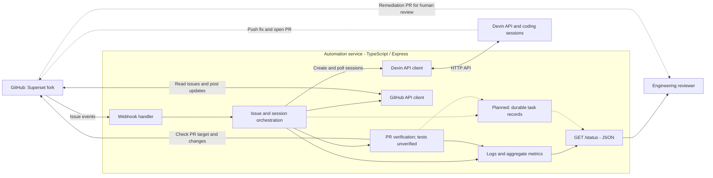
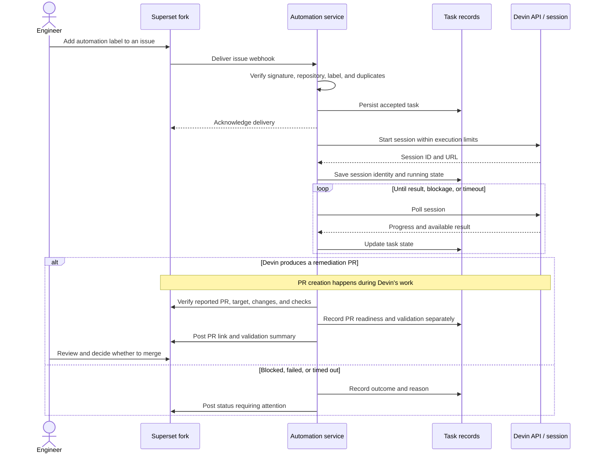

# Devin Automation Service

An event-driven issue remediation prototype for an Apache Superset fork. The intended workflow turns selected GitHub issues into pull requests through the Devin API, with observable progress and validation evidence.

## Current status

This is a prototype, not yet a demonstrated end-to-end remediation system. Local regression tests, TypeScript compilation, and lint pass. Live Devin integration and successful remediation remain unverified.

| Component | Current state |
| --- | --- |
| Express | Raw-body signature verification, event filtering, process-local deduplication, health, and JSON status routes are implemented. |
| Devin client | Session creation, polling, and cancellation code exists; the API contract and lifecycle assumptions need verification. |
| GitHub client | Issue reads/comments, branch/PR creation, and issue closure methods exist. |
| Remediation handoff | Prompts assign a unique branch; GitHub verification requires an open, non-draft PR with changes in the intended fork and base. Live handoff remains unverified. |
| Observability | PR readiness and unverified validation are reported separately; notification failures no longer change outcomes. Restart recovery remains incomplete. |
| Docker | Multi-stage build compiles source and installs dependencies from the lockfile. See Docker status below for verification. |
| Validation | Compilation, lint, and eight regression tests pass. |

## Workflow and architecture

### High-level overview

This is the intended end-to-end architecture. The service scaffold exists; the live integration and actual remediation PR handoff still need completion and verification.

```text
+------------------+      +------------------------+      +------------------+
| GitHub webhook   |----->| Automation service     |----->| Devin API        |
| Issue events     |      | Express / TypeScript   |<-----| Coding sessions  |
+------------------+      |                        |      +------------------+
                          | - Session coordination |               |
                          | - GitHub client        |               | Fix, test,
                          | - Logs and metrics     |               | open PR
                          +------------------------+               v
                               |              |          +------------------+
                  Read issues, |              |          | Superset fork    |
                  post updates |              |          | Remediation PR   |
                               +------------------------>|                  |
                                              |          +------------------+
                                              v                   |
                                     +------------------+         |
                                     | Status report    |         |
                                     | Progress / links |         |
                                     +------------------+         |
                                              |                   |
                                              v                   v
                                     +--------------------------------------+
                                     | Engineering reviewer                 |
                                     | Inspect evidence and review the PR   |
                                     +--------------------------------------+
```

The service starts and monitors Devin's work, then verifies and reports the resulting PR. Logs and metrics cover the workflow as a whole rather than only GitHub operations.

The scaffold receives issue events, fetches the configured repository's issue, checks eligibility, creates a Devin session, polls it, and attempts GitHub updates.

### Components and boundaries

Solid arrows represent integration paths present in the code, not verified live behavior. Dashed arrows represent planned work or the unverified external remediation handoff.



The placeholder branch creation has been removed. The service discovers Devin's PR through the unique branch assigned to the run, using GitHub's [pull request API](https://docs.github.com/en/rest/pulls/pulls#list-pull-requests). It does not infer passing tests from the presence of a PR.

### Target execution flow

This sequence describes the intended completed system. Durable task state, spending limits, and test/check verification remain implementation work. Current deduplication and concurrency controls operate within one process.



Devin performs the engineering work; this service coordinates it. Human review and merging remain outside the intended automation scope. Session completion alone does not establish a successful fix.

The stack is Node.js 20+, TypeScript, Express, Axios, Octokit, Winston, and dotenv.

## Local setup

From this repository's root:

```bash
npm ci
cp .env.example .env
# Edit .env with your configuration.
npm run typecheck
npm run build
npm start
```

Use `npm run dev` to run the TypeScript entry point directly. These are the scaffold's startup commands; live integration has not been validated. Missing credentials currently produce warnings instead of preventing startup.

With the service running on the default port:

```bash
curl http://localhost:3000/
curl http://localhost:3000/health
curl http://localhost:3000/status
```

`/health` reports process availability, not GitHub or Devin connectivity. `/status` returns JSON rather than a graphical dashboard. A credential-free workflow simulation is planned but not implemented.

### Configuration

These describe the current implementation, including API defaults still requiring verification. Keep credentials in the Git-ignored `.env` file.

| Variable | Purpose | Current default |
| --- | --- | --- |
| `DEVIN_API_KEY` | Devin credential | Empty; startup warning |
| `DEVIN_ORG_ID` | Organization used in API paths | Empty; startup warning |
| `DEVIN_API_BASE_URL` | API base URL | `https://api.devin.ai/v3` |
| `GITHUB_TOKEN` | GitHub credential | Empty; startup warning |
| `GITHUB_REPO_OWNER` | Target fork owner | `chengify` |
| `GITHUB_REPO_NAME` | Target repository | `superset` |
| `GITHUB_WEBHOOK_SECRET` | Webhook signing secret | Empty; startup warning |
| `PORT` | HTTP port | `3000` |
| `NODE_ENV` | Environment/logging behavior | `development` |
| `AUTO_LABEL` | Automation eligibility label | `devin-automation` |
| `SESSION_TIMEOUT_MINUTES` | Polling timeout | `30` |
| `MAX_CONCURRENT_SESSIONS` | Concurrent issue-processing limit | `3`; enforced within one process |

### Docker status

The Dockerfile installs locked dependencies, compiles TypeScript in a build stage, and copies the output into a runtime image containing production dependencies. Local `dist` is deliberately excluded. The dependency lockfile is included in version control.

```bash
docker compose up --build
```

The image build passed, and `/health` and `/status` returned 200 in a temporary network-isolated container. Live credentials and repository access are still needed to process real events. Compose with live configuration has not been exercised.

### Webhook status

The intended configuration uses the fork's **Issues** events, JSON content type, the shared signing secret, and `https://<service-host>/webhook/github`. Adding the automation label should select an issue for processing.

The handler verifies the original signed bytes, the repository, open issue state, and configured label. For label events, the specific label added must match. It requires `X-GitHub-Delivery` and remembers up to 10,000 accepted deliveries for 24 hours in memory. Overlapping runs for the same issue are suppressed. At capacity it returns 503 without recording the delivery: manually redeliver after capacity is available; no automatic retry queue is implemented. Restarting clears replay protection and does not resume monitoring.

Verify the Devin API contract before enabling live events. Real events can initiate paid sessions and post issue comments, but the service no longer closes issues automatically.

## Known gaps

1. **Live integration:** Verify the Devin API contract and demonstrate a real session producing a PR. The current lifecycle assumptions remain unverified.
2. **Validation evidence:** PR readiness is checked, but test results are explicitly `unverified`. Add CI/test evidence before claiming a validated remediation.
3. **Session controls:** Handle blocked/terminal states against the verified API and apply a supported spending limit. Polling currently retries all errors at a fixed interval. A polling/stop failure can release local capacity while remote work continues; the current limit controls local tasks, not guaranteed remote spend.
4. **Durable tasks:** Persist recoverable task records and delivery IDs, resume monitoring after restart, and derive aggregates from records. Existing metrics files can contain stale counts from previous runs; corrected accounting applies to newly processed tasks and does not repair historical data.
5. **Simulation:** Provide a user-facing credential-free simulation. Regression tests use fake clients but are not yet a complete demo command.

Logs are written to `logs/combined.log` and `logs/error.log`; aggregate metrics are saved in `logs/metrics.json`. Log rotation is not implemented. Running sessions are not stored as recoverable task records.

For new runs, `successfulSessions` means a completed session with a verified reviewable PR, not passing tests or a merged fix. `activeSessions` counts eligible tasks from preparation through PR verification. Failures fetching an issue before task creation appear in activity but do not increment session counters. Final activity includes the PR URL and `validation: unverified` where applicable.

## Candidate Superset issues

The local Superset checkout points to `chengify/superset`. [Issues #1–4](https://github.com/chengify/superset/issues) were verified on September 9, 2026: all were open and had no labels at that time.

| Candidate | Required refinement |
| --- | --- |
| Database utility duplication | Specify the actual refactor, affected callers, and regression tests; removing TODO text alone is not a fix. |
| Embedded dashboard UUID filtering | Establish compatibility requirements before removing integer-ID behavior. |
| Paramiko constraint | Establish a concrete dependency problem and compatibility evidence; the notes do not establish a vulnerability. |
| Frontend type safety | Select specific files, bounded changes, and a reproducible type check. |

Choose one or two issues with clear acceptance criteria. No remediation is claimed complete here.

## Validation and source layout

Local checks observed on September 9, 2026:

| Command | Result |
| --- | --- |
| `npm run typecheck` | Passed. |
| `npm run lint` | Passed. |
| `npm test` | Passed: eight Node.js regression tests, including build. No external API calls. |
| Docker build and container smoke check | Passed; `/health` and `/status` returned 200. |
| Live issue-to-PR execution | Not verified. |

```text
src/index.ts                 Express routes and startup
src/config/index.ts          Environment configuration
src/webhook/handler.ts       Issue event handling
src/automation/service.ts    Issue/session orchestration
src/devin/client.ts          Devin HTTP client and polling
src/github/client.ts         GitHub operations and signature helper
src/observability/           Logging and aggregate metrics
Dockerfile                   Multi-stage build and runtime image
docker-compose.yml           Service configuration
tests/workflow.test.cjs       Webhook, orchestration, and PR regression tests
```

## Demo and submission

Demonstrate a real event starting a Devin session and producing a reviewable Superset fix with validation evidence. Provide the solution repository, the fork with selected issues and remediation PRs, verified Docker/run-or-simulate instructions, and a five-minute Loom covering the problem, demo, architecture, Devin's role, and next steps.

Report observed outcomes; label projected time savings as estimates. The known gaps above describe the remaining implementation work.
